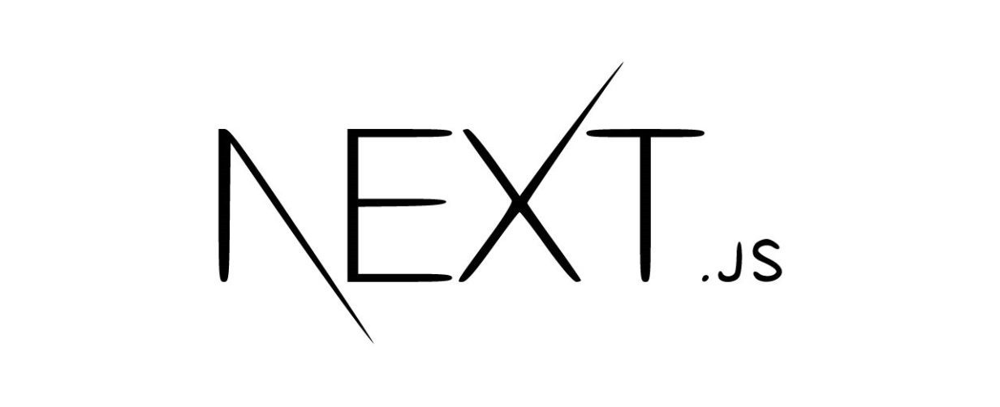
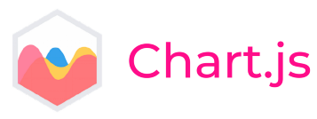
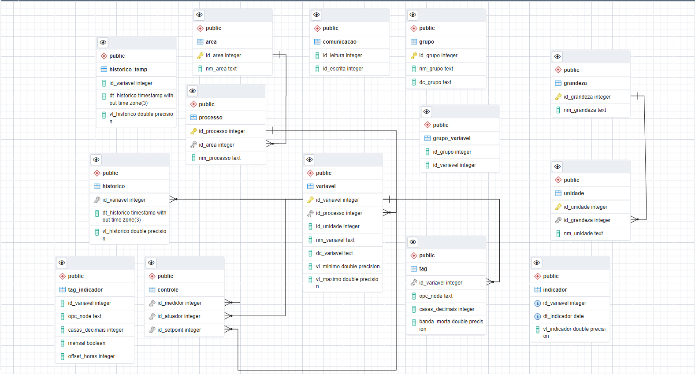

#   Arquitetura do projeto
 
### Finalidade
 

O documento estabelecerá uma visão da arquitetura de <em>software</em> adotada no sistema Visualeasy. Com isso ele tem como finalidade evidenciar com clareza as decisões arquiteturais tomadas no projeto. Disponibilizando as informações essenciais para as pessoas desenvolvedoras e demais envolvidos a respeito da aplicação e das tecnologias que serão utilizadas no desenvolvimento do projeto.

 
### Escopo

 Essa documentação foi elaborada sobre a visão de arquitetura de <em>software</em> que será utilizada para a implementação do projeto Visualeasy, para a evidenciar as decisões tomadas. Serão abordados os padrões de arquitetura, os <em>frameworks</em> que serão usados no desenvolvimento do projeto. O objetivo é fornecer visualização gráfica de séries temporais, proporcionando uma melhor visualização dos dados fornecidos à aplicação e permitindo uma tomada de decisão com base na análise dos dados.

 

## Visão Geral
 

Aqui serão detalhados as características primordiais da arquitetura adotada pela equipe desenvolvedora. Estarão presentes a representação arquitetural, as restrições de arquitetura, visão lógica, de implementação e de dados.

 
### Representação da Arquitetura
 

Para o desenvolvimento do sistema Visualeasy, foi decidido a utilização de uma arquitetura em microsserviços. Microsserviços são uma abordagem arquitetônica e organizacional do desenvolvimento de <em>software</em>, onde o <em>software</em> consiste em pequenos serviços independentes que se comunicam usando APIs bem definidas. Esses serviços pertencem a pequenas equipes autossuficientes.

 

As arquiteturas de microsserviços facilitam a escalabilidade e agilizam o desenvolvimento de aplicativos, habilitando a inovação e acelerando o tempo de introdução de novos recursos no mercado.

 
No sistema Visualeasy foi decidido, a criação de 2 microsserviços, sendo eles:
 
- **Frontend**: Responsável pela visualização de todo o sistema.
- **Controle**: Responsável pelo envio e tratamento dos dados de todas as variáveis que serão visualizadas nos gráficos.

Há a possibilidade da adição de mais 1 microsserviço, que ficará como um possível incremento ao projeto, e devido ao tempo insuficiente de duração do projeto, não será implementado. Este microsserviço é:

 
- **Usuario**: Responsável por lidar com a autenticação no sistema e com a criação dos perfis de usuário dentro do sistema.

A utilização de microsserviços traz como benefícios o desacoplamento das funcionalidades do sistema. Portanto, a alteração de um deles ou até mesmo a queda de algum deles, não afetará o resto do sistema, podendo as outras funcionalidades continuarem em execução normalmente.

 

Para o desenvolvimento dos microsserviços foi utilizado as seguintes tecnologias:

 

#### Node JS
 

 

Para o microsserviço de controle e de autenticação foi utilizado o Node.JS. Node é uma plataforma de aplicação, onde  programas são escritos em JS e compilados, otimizados e interpretados pela Máquina Virtual V8, sendo a mesma usada pelo Google para executar JavaScript no navegador Chrome. O resultado deste processo é entregue como código de máquina server-side, tornando o Node muito mais eficiente na sua execução e consumo de recursos. A plataforma Node foi escolhida por ser eficiente na implementação de aplicações em tempo real, que precisam transferir mensagens de um lado para o outro de forma rápida. As mensagens geradas pelo Visualeasy podem demandar um grande volume de dados a cada requisição do sistema.

 

#### Next.JS
 

 

Para o microsserviço responsável pelo front-end foi utilizado o NextJS. O Next.JS é um <em>framework</em> para React que é uma biblioteca javascript. O seu foco é no alto desempenho onde reúne diversas funcionalidades como renderização híbrida e estática de conteúdo. Possui suporte a TypeScript, pre-fetching, sistema de rotas, pacotes de funcionalidades e diversos plugins, o <em>framework</em> será utilizado, como parte front-end do nosso projeto, em que mostrará as telas e apresentará os recursos de gráfico, login dentre outras funcionalidades.

 

#### Chart.js
 

Para a exibição dos gráficos foi escolhida a biblioteca Chart.js. O Chart.js é uma biblioteca em Javascript de código aberto e que é muito utilizada pela comunidade. Essa biblioteca utiliza apenas HTML, CSS, JS e utilizando-se do elemento canvas do HTML5 para gerar gráficos na tela do usuário, o que torna uma ferramenta mais acessível e de fácil aprendizado para implementação no projeto. O Chart.js possui suporte responsivo, legenda para os gráficos, opções de gráficos interativos e modulares, entre outras funcionalidades que abrangem todo o escopo do projeto. 

 

#### PostgreSQL
 

Para banco de dados foi escolhido o PostgreSQL. O PostgreSQL é um Sistema Gerenciador de Banco de Dados Relacional de código aberto que utiliza a linguagem SQL para armazenar seguramente os dados, extensível e possui um vasto ecossistema de ferramentas. É um software projetado para possuir compatibilidade com os principais sistemas operacionais como Linux e Windows. Por essas características esse Banco de Dados tem sido bastante utilizado no contexto geral de negócios, sites e por isso foi o escolhido como a solução de banco de dados do Visualeasy.

 

### Metas e restrições da arquitetura
 
Metas:

+ Funcionar nos principais browsers utilizados atualmente: Mozilla Firefox, Google Chrome e Microsoft Edge.
 
+ O código deve ser modularizado, facilitando a manutenção e com baixo acoplamento.
 
Restrições:

+ Conexão com a Internet;
+ Conexão com a API;
+ Conexão ao Banco de Dados;

 

### Ambiente e Ferramentas de Desenvolvimento
 
| Requisito | Ferramenta/Solução | Versão |Descrição |
|----|-----|---|---|
|Linguagem|Javascript|ES6|Linguagem de programação interpretada e multiparadigma|
|Framework|Node.js|16.16.0|Ambiente de execução Javascript server-side|
|Framework|Next.js|12.2.2|Framework React |
|Biblioteca|Chart.js |3.8.2| Biblioteca Javascript para renderização de gráficos|
|Base de dados|PostgreSQL|14|Sistema Gerenciador de Banco de Dados de código aberto|
|Virtualização|Docker|20.10.17|Plataforma aberta para empacotamento e execução de aplicações em contêineres|
|Virtualização|Docker-compose|3.9|Gerenciamento de contêiner|
|Biblioteca|Jest|28.1.3|Biblioteca de testes|
 
 

## Visão Lógica
 

Esta sessão apresenta os pacotes de design significativos do ponto de vista da arquitetura para o projeto Visualeasy.

 
### Pacotes Visualeasy (API)
 

 

Os pacotes mais significativos da API do Visualeasy são detalhados a seguir.

 
#### Model

A Model identifica as entidades a serem utilizadas na aplicação de maneira correlacionada com conceitos abstraídos das circunstâncias apresentadas no mundo real. Nessa camada também é implementado a comunicação com o banco de dados.

 
#### Controller
 

Dentro da controller ficam os arquivos responsáveis pela serialização dos dados. Serialização é o processo de conversão de um objeto em um fluxo de bytes para armazenar o objeto ou fluxo na memória, em um banco de dados, ou em um arquivo, ou transmiti-lo por uma conexão de rede, seja em forma binária ou em formato de texto como o JSON. Sua finalidade principal é salvar o estado de um objeto para conseguir recriá-lo quando necessário. Logo, é um método simples e robusto para tornar objetos persistentes.

 
#### Routes

Responsável por endereçar a lógica utilizando uma interface de comunicação baseada no protocolo HTTP. Processo realizado através do roteamento que determina como um aplicativo responde a uma solicitação do cliente, que vem através de um URI (caminho) e um método de solicitação HTTP específico (ex: GET, POST). Uma rota pode ter uma ou mais funções que são executadas quando a solicitação corresponde com o endereçamento da rota.

 
#### __tests__

Outro pacote tão importante quanto o da source são os de testes utilizando o jest.js, serão realizadas verificações de unidade e integração para garantir a qualidade do software entregue.

 

## Arquitetura dos Serviços e visão de Implementação
 
### Visão Geral
 

 
 
 
Cada microsserviço é detalhado da seguinte forma:
 
- 
<b>Visualização de dados/gráficos:</b> Front-end do produto composto pelo <em>framework</em> Next.Js, para a construção das telas, campos, validações e botões que o usuário irá interagir. Acompanhando o Next.Js, o Chart.Js é responsável pela visualização dos dados tratados, gerando os gráficos.

- 
<b>Core:</b>O Core é composto pelas APIs responsáveis pela autenticação de usuário e pelo controle, coleta de dados e geração de gráficos.

- 
<b>Core:</b>A API responsável pela autenticação de usuário, foi prevista na arquitetura. Porém, não foi implementada nesta versão da aplicação.

     

 

## Visão de Dados
 

Para a primeira versão da aplicação e para se adequar a questão do tempo disponível para a entrega. A visão de dados faz uma consulta a apenas a tabela "variavels" que possui atributos de acordo com o arquivo .csv disponibilizado pelo cliente para população e testes da aplicação.

 

 
Para atualizações futuras e conforme a necessidade para a implantação no sistema do cliente a estrutura do banco será baseada nesse diagrama lógico de dados.
 

 

## Qualidade
 

A norma ISO/IEC 25010 define 8 características de qualidade que todos os <i>software</i> devem ter, de forma a alcançar um nível muito alto de qualidade no <i>software</i> que será entregue. São elas: adequação funcional; eficiência de performance; compatibilidade; usabilidade; confiabilidade; segurança; portabilidade e; capacidade de manutenção.

Os desenvolvedores do presente projeto buscam garantir que todas as características definidas pela ISO 25010 estejam presentes no produto Visualeasy, com atenção em especial à 4 características de qualidade, apresentadas na imagem a seguir, indispensáveis para a qualidade do produto Visualeasy. Cada característica é detalahda nos próximos tópicos.

### Adequação Funcional

Essa característica representa o grau em que o produto ou sistema fornece funções que satisfazem as necessidades declaradas e implícitas dos usuários, quando utilizadas sob condições especificadas.

No projeto Visualeasy, as necessidades do usuário foram analisadas e especificadas durante o desenvolvimento do <a href="https://fga-eps-mds.github.io/2022-1-Visualeasy-Doc/visao-produto/lean-inception/"><i>Lean Inception</i></a>, e por fim, foram listadas em forma de histórias de usuário no <a href="https://fga-eps-mds.github.io/2022-1-Visualeasy-Doc/documentacao/backlog/"><i>Product Backlog</i></a>.

### Usabilidade

Característica de um sistema que pode ser utilizado pelos mais diferentes usuários para atingir diversos objetivos específicos com eficácia, eficiência e satisfação.

A interface do Visualeasy é projetada para ser fácil de operar e controlar, com navegabilidade intuitiva, para garantir que o sistema possa ser utilizado por usuários com a mais ampla gama de características e capacidades.

### Portabilidade 

Grau de eficácia e eficiência com o qual um sistema pode ser transferido de um <i>hardware</i>, <i>software</i> ou outro ambiente operacional, ou de utilização para outro.

Esta é uma característica indispensável ao produto Visualeasy, visto que um dos objetivos do projeto é que os POs testem, a cada release, as novas funcionalidades implementadas. Sendo assim, o sistema deve ser adaptável a diferentes ambientes.

### Capacidade de Manutenção

Esta característica representa o grau de eficácia e eficiência com que um sistema pode ser modificado para o melhorar, corrigir ou adaptar às mudanças de ambiente e/ou requisitos.

Por ser um projeto desenvolvido ao longo de mais de um semestre, por diferentes equipes, o sistema Visualeasy deve possuir elevada capacidade de manutenção, para garantir que outros desenvolvedores possam adicionar novas funcionalidades e melhorias facilmente.

 

## Referências
 
+ Node.js. <b>About Node.js</b>. Disponível em: [Node](https://nodejs.org/en/). Acesso em 20 de Julho de 2022.

+ Docker docs. <b>Docker overview</b>. Disponível em: [Docker](https://docs.docker.com/get-started/overview/). Acesso em 21 de Julho de 2022.

+ Postgresql. <b>About Postgresql</b>. Disponível em: [Postgres](https://www.postgresql.org/about/). Acesso em 21 de Julho de 2022.

+ Microsoft Azure. <b>O que é PostgreSQL?</b> Disponível em: [Azure](azure.microsoft.com/pt-br/resources/cloud-computing-dictionary/what-is-postgresql/). Acesso em 21 de Julho de 2022.

+ Next.js. <b>The React Framework for Production</b>. Disponível em: [Next.js](nextjs.org/). Acesso em 21 de Julho de 2022.

+ nata.house. <b>O que é um bom software? Identifique essas 5 características!</b> Disponível em: [Natahouse](natahouse.com/pt/o-que-e-um-bom-software-identifique-essas-5-caracteristicas). Acesso em 21 de Julho de 2022.

+ AWS. <b>O que são microsserviços?</b> Disponível em: [AWS](https://aws.amazon.com/pt/microservices/.) Acesso em 21 de Julho de 2022.

+ ISO/IEC 25010. <b>ISO 2500</b>. Disponível em: [ISO/IEC 25010](https://iso25000.com/index.php/en/iso-25000-standards/iso-25010). Acesso em 10 de agosto de 2022.

+ Wikipédia. <b>ISO/IEC 25010</b>. Disponível em: [Wikipédia - ISO/IEC 25010](https://pt.wikipedia.org/wiki/ISO/IEC_25010). Acesso em 10 de agosto de 2022.

+ Chart.js. <b>Chart.js</b>. Disponível em: [Chart.js](https://www.chartjs.org/docs/latest/). Acesso em 13 de setembro de 2022.

+ Gigasystems. <b>Criando Gráficos com Chart.js com legenda</b>. Disponível em: [Gigasystems](https://www.gigasystems.com.br/artigo/90/criando-graficos-com-chart.js-com-legenda). Acesso em 13 de setembro de 2022.

## Versionamento
 
| Data | Versão | Descrição | Autor(es) |
|------|------|------|------|
|19/07/2022|1.0|Criação do documento de arquitetura do projeto| [Bruna Santos](https://github.com/brunaalmeidasantos),[Estevão Reis](https://github.com/estevaoreis25), [Itallo Gravina](https://github.com/itallogravina), [Luis Bruno](https://github.com/lbrunofidelis), [Damarcones Porto](https://github.com/damarcones), [Bruno Nunes](https://github.com/brunocmo), [Marcos Vinicius](https://github.com/marcos-mv), [Gustavo Moreira](https://github.com/gustavoduartemoreira), [Gabriel Batalha](https://github.com/gustavoduartemoreira), [João Pedro](https://github.com/Joao-Pedro-Moura)|
|23/07/2022|1.1|Correções e Adição do documento ao reposítório | [Marcos Vinicius](https://github.com/marcos-mv)
|25/07/2022|1.2|Revisão ortográfica do documento| [Gustavo Moreira](https://github.com/gustavoduartemoreira)
|01/08/2022|1.3|Adição do tópico Visão de Dados, Visão Lógica-controle| [Marcos Vinicius](https://github.com/marcos-mv)
|14/08/2022|1.4|Refatora tópico de qualidade|[Bruna Santos](https://github.com/brunaalmeidasantos), [Damarcones Porto](https://github.com/damarcones)|
|15/08/2022|1.5|Revisão ortográfica do documento|[Damarcones Porto](https://github.com/damarcones)|
|08/09/2022|1.6|Refatora tópico de qualidade|[Bruna Santos](https://github.com/brunaalmeidasantos)|
|13/09/2022|1.7|Refatoração do tópico de Representação da arquitetura|[João Pedro](https://github.com/Joao-Pedro-Moura)|