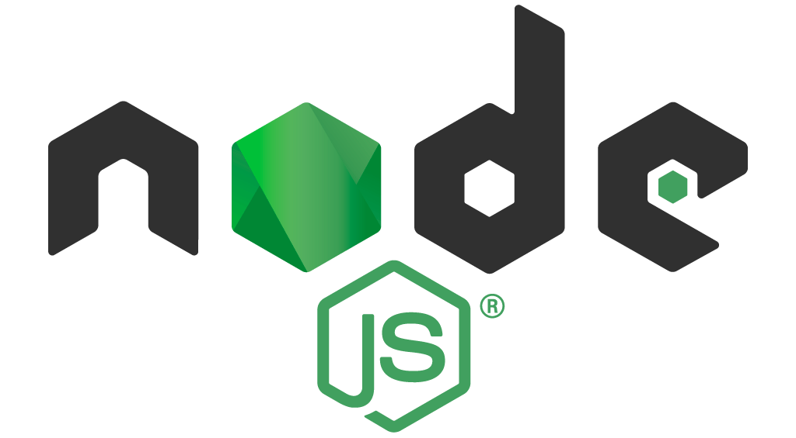

#   Arquitetura do projeto

### Finalidade

O documento estabelecerá uma visão da arquitetura de <em>software</em> adotada no sistema Visualeasy. Com isso ele tem como finalidade evidenciar com clareza as decisões arquiteturais que foram tomadas no projeto. Disponibilizando as informações essenciais para as pessoas desenvolvedoras e demais envolvidos a respeito da aplicação e das tecnologias que serão utilizadas no desenvolvimento do projeto.

### Escopo

 Essa documentação foi elaborada sobre a visão de arquitetura de <em>software</em> que será utilizada para a implementação do projeto Visualeasy, para a evidenciar as decisões tomadas. Serão abordados os padrões de arquitetura, os <em>frameworks</em> que serão usados no desenvolvimento do projeto. O objetivo é fornecer visualização gráfica de séries temporais, proporcionando uma melhor visualização dos dados fornecidos à aplicação e permitindo uma tomada de decisão com base na análise dos dados.

### Visão Geral

Aqui serão detalhados as características primordiais da arquitetura adotada pela equipe desenvolvedora. Estarão presentes a representação arquitetural, as restrições de arquitetura, visão lógica, de implementação e de dados.

#### Representação da Arquitetura

Para o desenvolvimento do sistema Visualeasy, foi decidido a utilização de uma arquitetura em microsserviços. Microsserviços são uma abordagem arquitetônica e organizacional do desenvolvimento de <em>software</em> onde o <em>software</em> consiste em pequenos serviços independentes que se comunicam usando APIs bem definidas. Esses serviços pertencem a pequenas equipes autossuficientes.

As arquiteturas de microsserviços facilitam a escalabilidade e agilizam o desenvolvimento de aplicativos, habilitando a inovação e acelerando o tempo de introdução de novos recursos no mercado.

No sistema Visualeasy foi decidido a criação de 3 microsserviços, sendo eles:

- **Frontend**: Responsável pela visualização de todo o sistema.
- **Controle**: Responsável pelo envio e tratamento dos dados de todas as variáveis que serão visualizadas nos gráficos.
- **Autenticação**: Responsável por lidar com a autenticação no sistema e com a criação dos perfis de usuário dentro do sistema.

A utilização de microsserviços traz como benefícios o desacoplamento das funcionalidades do sistema. Portanto, a alteração de um deles ou até mesmo a queda de algum deles, não afetará o resto do sistema, podendo as outras funcionalidades continuarem em execução normalmente.

Para o desenvolvimento dos microsserviços foi utilizado as seguintes tecnologias:

#### Node JS

Para o microsserviço de controle e de autenticação foi utilizado o Node.JS. Node é uma plataforma de aplicação, onde  programas são escritos em JS e compilados, otimizados e interpretados pela Máquina Virtual V8, sendo a mesma usada pelo Google para executar JavaScript no navegador Chrome. O resultado deste processo é entregue como código de máquina server-side, tornando o Node muito mais eficiente na sua execução e consumo de recursos. A plataforma Node foi escolhida por ser eficiente na implementação de aplicações em tempo real, que precisam transferir mensagens de um lado para o outro de forma rápida. As mensagens geradas pelo Visualeasy podem demandar um grande volume de dados a cada requisição do sistema.

#### Next.JS

Para o microsserviço responsável pelo front-end foi utilizado o NextJS. O Next.JS é um <em>framework</em> para React que é uma biblioteca javascript. O seu foco é no alto desempenho onde reúne diversas funcionalidades como renderização híbrida e estática de conteúdo. Possui suporte a TypeScript, pre-fetching, sistema de rotas, pacotes de funcionalidades e diversos plugins, o <em>framework</em> será utilizado, como parte front-end do nosso projeto, em que mostrará as telas e apresentará os recursos de gráfico, login dentre outras funcionalidades.

   
#### D3.js

Para a exibição dos gráficos foi escolhida a biblioteca D3.js. A D3.js é uma biblioteca em Javascript orientada a dados. Não é um <em>framework</em> monolítico, fornecendo uma melhor escalabilidade. D3 é rápido e trabalha com altos volumes de dados e interações com animações, assim evitando uma sobrecarga no sistema como um todo.

#### PostgreSQL

Para banco de dados foi escolhido o PostgreSQL. O PostgreSQL é um Sistema Gerenciador de Banco de Dados Relacional de código aberto que utiliza a linguagem SQL para armazenar seguramente os dados, extensível e possui um vasto ecossistema de ferramentas. É um software projetado para possuir compatibilidade com os principais sistemas operacionais como Linux e Windows. Por essas características esse Banco de Dados tem sido bastante utilizado no contexto geral de negócios, sites e por isso foi o escolhido como a solução de banco de dados do Visualeasy.

### Metas e restrições da arquitetura

Metas:
- Funcionar nos principais browsers utilizados atualmente: Mozilla Firefox, Google Chrome e Microsoft Edge.

- O código deve ser modularizado, facilitando a manutenção e com baixo acoplamento.

Restrições:
- Conexão com a Internet;
- Conexão com a API;
- Conexão ao Banco de Dados;

### Ambiente e Ferramentas de Desenvolvimento

| Requisito | Ferramenta/Solução | Versão |Descrição |
|----|-----|---|---|
|Linguagem|Javascript|ES6|Linguagem de programação interpretada e multiparadigma|
|Framework|Node.js|16.16.0|Ambiente de execução Javascript server-side|
|Framework|Next.js|12.2.2|Framework React |
|Biblioteca|D3.js |7.6.1| Biblioteca Javascript orientada a dados|
|Base de dados|PostgreSQL|14|Sistema Gerenciador de Banco de Dados de código aberto|
|Virtualização|Docker|20.10.17|Plataforma aberta para empacotamento e execução de aplicações em contêineres|
|Virtualização|Docker-compose|3.9|Gerenciamento de contêiner|
|Biblioteca|Jest|28.1.3|Biblioteca de testes|

### Visão Lógica
Detalhar micro serviços aqui

### Arquitetura dos Serviços e visão de Implementação

#### Visão Geral

Cada microsserviço é detalhado da seguinte forma:

- 
Visualização de dados/gráficos : Front-end do produto composto pelo <em>framework</em> Next.Js, para a construção das telas, campos, validações e botões que o usuário irá interagir. Acompanhando o Next.Js, o D3.Js é responsável pela visualização dos dados tratados, gerando os gráficos.

- 
O Core é composto pelas APIs responsáveis pela autenticação de usuário e pelo controle, coleta de dados e geração de gráficos.

## Visão de Dados

## Qualidade

Para garantir a qualidade do sistema Visualeasy, serão seguidas 6 características de qualidade de software, definidas pela ISO9126 (em português, NBR13596). Cada característica está detalhada a seguir.

### Funcionalidade

A funcionalidade de um software diz respeito à satisfação de necessidades que deram origem ao projeto. Abrange requisitos implícitos e explícitos e está intimamente ligada à qualidade do código criado. Neste sentido, o Visualeasy deve corresponder ao objetivo que originou sua demanda, e deve atender as necessidades que foram previstas para o usuário comum.

A característica de funcionalidade abrange também questões de segurança do sistema. O desenvolvimento do Visualeasy deve garantir que apenas usuários autorizados tenham acesso às informações do sistema. Para isso, será implementado um sistema de autenticação de usuários, com a utilização de tokens para validação de acessos.

### Confiabilidade

É a garantia que o software dá em não apresentar falhas em um período de tempo e ambiente específico. O Visualeasy busca apresentar os dados fidedignos em gráficos conforme o requisitado no banco de dados.
Usabilidade

A usabilidade está relacionada à meta de garantir que os usuários usem bem as funcionalidades de um sistema. A navegabilidade do Visualeasy deve ser intuitiva e fácil de ser utilizada, para que os usuários possam acessar as funcionalidades disponíveis sem grande esforço.

### Eficiência

A eficiência se refere à forma como o sistema ajuda os usuários a realizar suas tarefas. O Visualeasy deve oferecer formas fáceis e rápidas para que o usuário encontre a funcionalidade ou informações que deseja. Além disso, o produto deve ser compatível com o nível que foi requerido para o produto. Sendo assim, o Visualeasy deve ser eficaz e atender necessidades dos Product Owners.

### Manutenibilidade

A manutenibilidade está diretamente ligada à qualidade do software que produziremos. Manutenções corretivas devem ser constantes a fim de corrigir bugs ou outros problemas ligados a utilização do sistema. O sistema deve ser capaz de se adaptar às mudanças do ambiente onde irá atuar. Por exemplo, atualizar o sistema operacional ou tecnologias, bibliotecas.

Também construiremos um sistema onde usuários (e/ou outros envolvidos) possam sugerir uma nova funcionalidade ou modificar alguma já existente, de modo a aumentar a qualidade ou prevenir futuros bugs, como manutenção preventiva. Utilizando ferramentas como sonarcloud podemos detectar problemas relacionados à qualidade de código escrito e construir um sistema mais fácil de se manter.

### Portabilidade

A portabilidade é a característica de um sistema de software de se comportar de maneira igual em diversos ambientes operacionais. Sendo desenvolvido em Javascript, o Visualeasy tem a característica de ser nativo nos navegadores mais usados atualmente. Além disso, desenvolver uma documentação abrangente permite manter a escalabilidade e a continuidade do software, independentemente do desenvolvedor.

## Referências

* About Node.js. Node.js. Disponível em: [Node](https://nodejs.org/en/). Acesso em 20 de Julho de 2022.
* Data-Driven Documents. D3.js. Disponível em: [D3.js](https://d3js.org/). Acesso em 20 de Julho de 2022.
* Docker overview. Docker docs. Disponível em: [Docker](https://docs.docker.com/get-started/overview/). Acesso em 21 de Julho de 2022.
* About Postgresql. Postgresql. Disponível em: [Postgres](https://www.postgresql.org/about/). Acesso em 21 de Julho de 2022.
* O que é PostgreSQL? Microsoft Azure. Disponível em: [Azure](azure.microsoft.com/pt-br/resources/cloud-computing-dictionary/what-is-postgresql/). Acesso em 21 de Julho de 2022.
* The React Framework for Production. Next.js. Disponível em: [Next.js](nextjs.org/). Acesso em 21 de Julho de 2022.
* O que é um bom software? Identifique essas 5 características! nata.house. Disponível em: [Natahouse](natahouse.com/pt/o-que-e-um-bom-software-identifique-essas-5-caracteristicas). Acesso em 21 de Julho de 2022.
* O que são microsserviços? AWS. Disponível em: [AWS](https://aws.amazon.com/pt/microservices/.) Acesso em 21 de Julho de 2022.
* Usabilidade e suas metas. Irla Rebelo, IHC na prática. Disponível em: [Irlabr](https://irlabr.wordpress.com/apostila-de-ihc/parte-1-ihc-na-pratica/6-usabilidade-e-suas-metas). Acesso em 21 de Julho de 2022.
* Rogers et al. (2013). Design de Interação: Além da Interação Humano-Computador - Capítulo 1 - O que é design de interação.
* Barbosa, S. D. J. and Silva, B. S. d. (2010). Interação Humano-Computador. Rio de Janeiro: Elsevier.

## Versionamento

| Data | Versão | Descrição | Autor(es) |
|------|------|------|------|
|19/07/2022|1.0|Criação do documento de arquitetura do projeto| [Bruna Santos](https://github.com/brunaalmeidasantos),[Estevão Reis](https://github.com/estevaoreis25), [Itallo Gravina](https://github.com/itallogravina), [Luis Bruno](https://github.com/lbrunofidelis), [Damarcones Porto](https://github.com/damarcones), [Bruno Nunes](https://github.com/brunocmo), [Marcos Vinicius](https://github.com/marcos-mv), [Gustavo Moreira](https://github.com/gustavoduartemoreira), [Gabriel Batalha](https://github.com/gustavoduartemoreira), [João Pedro](https://github.com/Joao-Pedro-Moura)|
|23/07/2022|1.1|Correções e Adição do documento ao reposítório | [Marcos Vinicius](https://github.com/marcos-mv)
|25/07/2022|1.2|Revisão ortográfica do documento| [Gustavo Moreira](https://github.com/gustavoduartemoreira)

