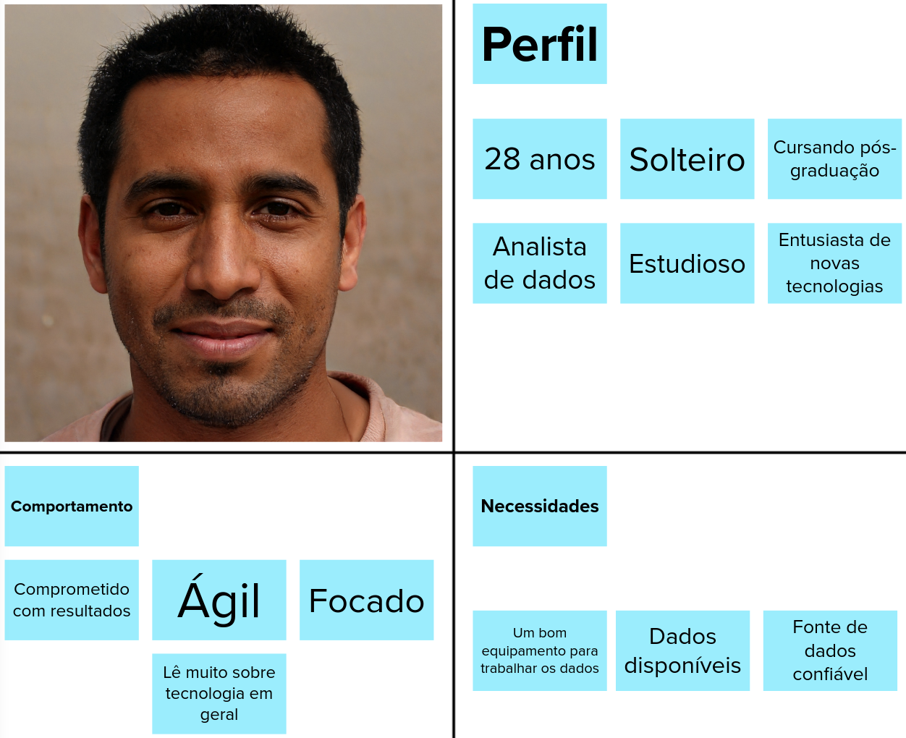
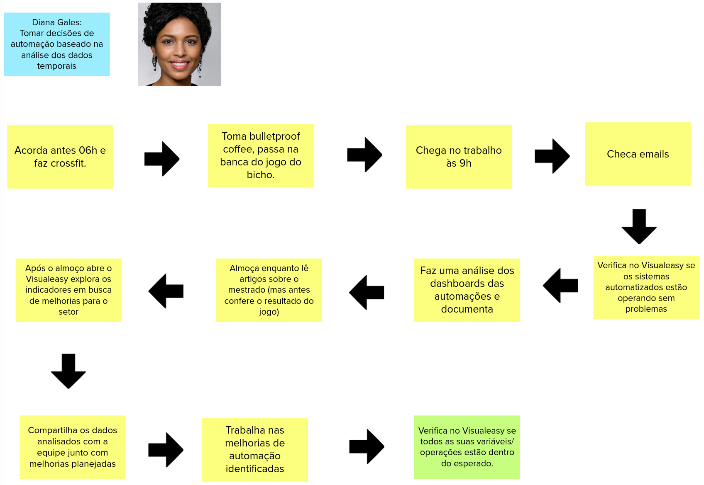

# <i>Lean Inception</i>

O <b><i>Lean Inception</i></b> é um manual que explica como devemos dar início à criação de um produto de <i>software</i> no modelo ágil, onde o objetivo é a flexibilidade e velocidade do desenvolvimento. O livro "Lean Inception" de Paulo Caroli, traz as experiências do autor em criar Inceptions através de 9 atividades feitas em grupo, que ajudam a equipe a construir o <b>Produto Viável Mínimo (MVP)</b> do projeto de <i>software</i>. O MVP é definido como a versão mais simples do produto a ser disponibilizada aos usuários para validar hipóteses de negócio.

O objetivo deste documento é apresentar o resultado das 9 atividades do <i>Lean Inception</i> desenvolvidas pela equipe ao longo de 3 semanas. A agenda a seguir apresenta a data de realização de cada atividade em equipe.

### Agenda

|Nº Atividade|Atividade                          |Data de realização|
|------------|-----------------------------------|------------------|
|      1     |Visão do Produto                   |23/06/2022|
|      2     |O produto É - NÃO É - FAZ - NÃO FAZ|23/06/2022|
|      3     |Objetivos de Negócio               |24/06/2022|
|      4     |Personas                           |24/06/2022|
|      5     |Jornada do Usuário                 |28/06/2022|
|      6     |Brainstorming de Funcionalidades   |28/06/2022|
|      7     |Revisão Técnica, de Negócio e UX   |30/06/2022|
|      8     |Sequenciador                       |05/07/2022|
|      9     |MVP Canvas                         |05/07/2022|

Os próximos tópicos detalham o desenvolvimento e o resultado de cada uma das atividades.

## Visão do Produto

A primeira atividade desenvolvida pelo grupo envolve a Visão de Produto. A visão de produto é o que deve nortear todas as decisões em relação ao produto de <i>Software</i>. Desta forma, a equipe foi dividida em três grupos, e foi solicitado a cada grupo que preenchesse as lacunas selecionadas de cada um dos três templates disponíveis. Os três templates preenchidos são mostrados a seguir.

Ao final, as lacunas preenchidas em cada template foram unidas, definindo a visão de produto da equipe sobre o <b>Visualeasy</b> como sendo:

>Para uma empresa de bebidas, cujo problema a ser resolvido é visualizar dados recebidos da fábrica, em diversos períodos. Assim, o Visualeasy é uma aplicação Web que fornece uma visualização gráfica de métricas históricas de variáveis de produção. Diferentemente de planilhas ou banco de dados brutos, que não são automatizados e não suportam o volume de dados, o nosso produto proporciona uma ferramenta de visualização de dados de forma gráfica ao longo do tempo, para auxiliar na tomada de decisões.

 

## O produto É - NÃO É - FAZ - NÃO FAZ

Nesta segunda atividade, a equipe foi dividida em dois grupos para fazer o artefato "É - Não É - Faz - Não faz". O primeiro grupo preencheu a primeira parte do quadro, em que deviam escrever suas visões sobre o que é o produto <b>Visualeasy</b>. Já o segundo grupo preencheu a segunda parte do quadro, escrevendo suas visões sobre o que o produto não é, e sobre o que ele não faz. O quadro preenchido pode ser visualizado a seguir.

 

## Objetivos de Negócio

Na terceira atividade, foram definidos os objetivos de negócio. Foi solicitado a cada participante que resumisse o produto em três objetivos para o negócio. Ao final, os objetivos escritos foram agrupados por similaridade em 'clusters'.

A imagem a seguir apresenta o resultado final dessa atividade, onde os 'clusters' estão na cor rosa, e os objetivos escritos por cada membro estão em amarelo.

 

## Personas

A atividade 5 consistiu em criar as personas para o projeto <b>Visualeasy</b>.Cooper (1999) define persona como um personagem fictício, arquétipo hipotético de um grupo de usuários reais, criada para descrever um usuário típico. É utilizada principalmente para representar um grupo de usuários finais durante discussões de design, mantendo todos focados no mesmo alvo. As personas são definidas principalmente por seus objetivos. (Barbosa e Silva, 2010).

Para realizar esta atividade, a equipe foi novamente dividida em três grupos, e cada grupo desenvolveu uma persona. Os detalhes de cada uma das três personas criadas para o projeto são descritas seguidamente.

### Persona 1: <b>João Connor</b>

### Persona 2: <b>Fábio Castro</b>

### Persona 3: <b>Diana Gales</b>

 

## Jornada do Usuário

Na atividade 5 do <i>Lean Inception</i>, o objetivo da equipe foi desenvolver jornadas de usuáŕio para as três personas criadas na atividade anterior. A jornada do usuário consiste na representação gráfica das etapas que envolvem o relacionamento do cliente com um produto ou serviço.

Novamente, a equipe foi dividida em três grupos, e cada grupo ficou responsável pela jornada de uma persona. Cada jornada levou em consideração o perfil e os objetivos de cada persona, e são apresentadas a seguir.

### Jornada de Usuário da Persona João Connor

### Jornada de Usuário da Persona Fábio Castro

### Jornada de Usuário da Persona Diana Gales

 

## <i>Brainstorming</i> de Funcionalidades

Nesta sexta atividade, o objetivo foi fazer um <i>Brainstorming</i> de funcionalidades baseado nas tarefas descritas nas jornadas dos usuários (atividade 5). Cada jornada foi lida em voz alta e os integrantes da equipe foram levntando suas ideias sobre funcionalidades que poderiam ser implementadas no <b>Visualeasy</b>.

As funcionalidades levantadas no <i>Brainstorming</i> são apresentadas na imagem a seguir.

 

## Revisão Técnica, de Negócio e UX

Na atividade 7 do <i>Lean Inception</i>, as funcionalizades foram caracterizadas quanto ao nível de confiança e valores de negócio, esforço e UX. O nível de confiança é classificado em cores: verde - fácil; amarelo - médio; e vermelho - difícil. Já os valores de negócio, esforço e UX são classificados em uma escala de 1 a 3 com os símbolos $, E e <3, respectivamente.

O resultado dessa atividade pode ser visto a seguir.

 

## Sequenciador

A nona atividade, feita em conjunto com toda a equipe, consistiu em desenvolver o sequenciador do projeto. O objetivo foi definir as 'ondas' do projeto, além de identificar quais funcionalidades fazem parte do MVP e quais pertencerão aos incrementos do projeto. O resultado é apresentado logo abaixo.

 

## MVP Canvas

Finalmente, na última atividade do <i>Lean Inception</i>, todos os artefatos desenvolvidos nas atividades anteriores que entram no escopo do MVP foram reunidas no quadro mostrado abaixo. Além disso, foram definidos o tempo e custo de desenvolvimento do MVP, os resultados que são esperados e as métricas que serão utilizadas para mensurar os resultados.

 

### Referências

+ <i>Ebook: Lean Inception</i>, Paulo Caroli;
+ O que é e como criar a visão e a estratégia do produto?. 2016. Disponível em: pt.linkedin.com/pulse/o-que-%C3%A9-e-como-criar-vis%C3%A3o-estrat%C3%A9gia-do-produto-joaquim-torres. Acesso em 19 de julho de 2022.
+ Livro: BARBOSA, S. D. J.; SILVA, B. S. Interação Humano-Computador. 1ª edição, Rio de Janeiro: Elsevier, 2010.
+ Jornada do Usuário: o que é e qual a importância?. 2022. Disponível: blog.opinionbox.com/jornada-do-usuario/. Acesso em 19 de julho de 2022.

### Versionamento

| Data | Versão | Descrição | Autor(es) |
|------|------|------|------|
|19/07/2022|1.0|Adiciona documento sobre o <i>Lean Inception</i>|[Bruna Santos](https://github.com/brunaalmeidasantos), [Damarcones Porto](https://github.com/damarcones)|